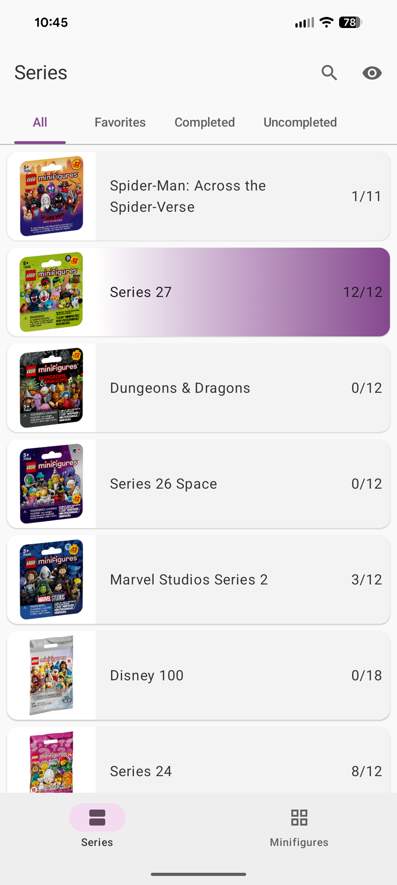
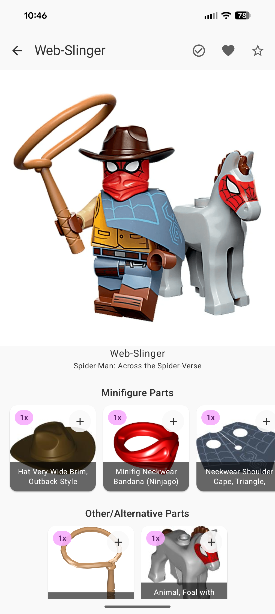
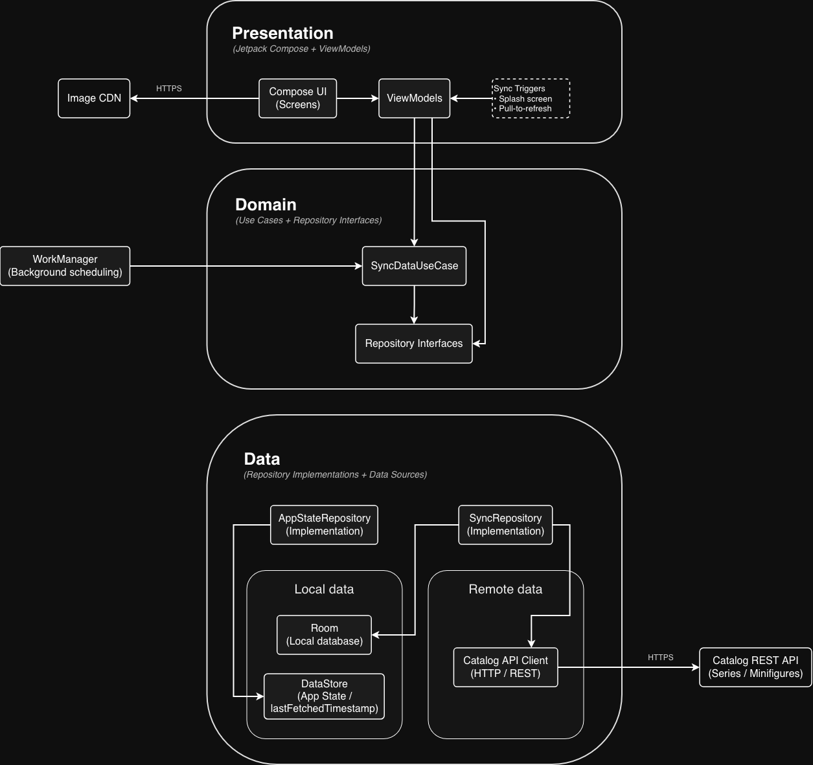

# Tracker for Minifigures Series

An offline-first Android app for browsing and tracking LEGO® Collectible Minifigures, built with Kotlin, Jetpack Compose, Room, and background synchronization.

This repository is a **public, read-only snapshot** of a production app and is no longer actively maintained.

## Screenshots / Demo

| Series | Minifigures | Minifigure Details |
|---|---|---|
| Browse and filter all series | Browse and filter all minifigures | View a minifigure's inventory |
|  |  |  |

**Demo video (90s):**  
Quick walkthrough of the app in action. 

[▶ Watch the demo on YouTube](https://www.youtube.com/shorts/Q0i59GUzVGg)

<p align="center">
  
</p>

## App Features

- Browse all LEGO® Collectible Minifigure series and minifigures with multiple layout and filter options
- Search across series and minifigures by name
- Hide individual series or minifigures to keep the catalog focused on items of interest
- Mark series as favorites
- Mark minifigures as collected, wishlisted, or favorites
- View detailed minifigure inventories, including parts and accessories
- Track inventory completeness by marking individual inventory items as collected
- Pull-to-refresh to manually sync the latest catalog data
- Automatic daily background synchronization to keep data up to date
- Fully functional offline experience after the initial data load
- Adaptive UI that responds to screen size and orientation (portrait, landscape)

## Tech Stack

- **Kotlin**
- **Jetpack Compose** (Material 3, adaptive layouts)
- **Navigation Compose**
- **Room** (prepackaged database, migrations, triggers)
- **WorkManager** (background sync)
- **Retrofit** + **Kotlin Serialization**
- **DataStore** (user preferences)
- **Coil** (image loading)
- **Hilt** (dependency injection)

## Technical Highlights

- **Offline-first architecture**  
  The app remains fully usable without a network connection after the initial data load. Local state is treated as the source of truth, with background and manual sync used to reconcile with the server.

- **Single, centralized sync use case**  
  All synchronization entry points (first launch, pull-to-refresh, background work) invoke a single `SyncDataUseCase`, ensuring consistent behavior and reducing duplicated logic.

- **Incremental data synchronization**  
  The app persists the timestamp of the last successful sync and requests only new or updated data from the backend, minimizing network usage and unnecessary database writes.

- **Schema-level invariant enforcement with SQLite triggers**  
  Data consistency rules—such as maintaining derived counts and keeping parent/child state in sync—are enforced at the database level. This reduces application-layer orchestration and ensures invariants are preserved regardless of the write path.

- **Transactional upserts with user-data preservation**  
  Server-owned fields are updated via transactional upserts, while user-owned state (e.g., collected, favorite flags) is preserved across syncs.

- **Robust migration strategy with automated testing**  
  Database migrations were written and verified using Room’s `MigrationTestHelper` to ensure schema correctness and prevent user data loss in production releases.

- **Reactive data streams with Kotlin Flow**  
  Room queries expose `Flow` streams, allowing the UI to react automatically to database updates without manual refresh logic.

- **Modern UI built with Jetpack Compose**  
  The UI is implemented entirely with Compose and Material 3, supporting adaptive layouts across screen sizes and orientations.

- **Background work managed by WorkManager**  
  Periodic background sync is scheduled with WorkManager, allowing the system to optimize execution based on device conditions such as battery and network availability.

## Architecture Overview

The following diagram illustrates the app’s high-level architecture and the primary responsibilities of each layer.



> **Note:**  
> Dependency injection is omitted for clarity. The app uses Hilt to provide concrete implementations and wiring across layers.

The app follows a **Presentation–Domain–Data** layering approach, with clear separation of concerns and unidirectional dependencies.

### Presentation Layer

The **presentation** layer contains all UI-related code and is responsible for rendering state and handling user interaction.
```
├── presentation/
│   ├── components/         # Shared UI components
│   ├── <screen>/           # Screen UI, state, and ViewModel
│   ├── util/               # Shared UI utilities
│   ├── AppNavHost.kt       # Navigation host
│   ├── MainActivity.kt     # App entry point
│   └── MainViewModel.kt    # App-level ViewModel
```

- The UI is implemented entirely using Jetpack Compose.
- Each screen owns its own ViewModel, which manages screen state and coordinates domain-layer operations. ViewModels invoke use cases for complex workflows, while some simple, read-only streams are observed directly from repositories to avoid unnecessary indirection.
- `MainActivity` hosts the Compose UI and initializes navigation via `AppNavHost`.
- `MainViewModel` coordinates app-level concerns such as scheduling background sync and triggering in-app reviews.
- Image-heavy screens use Coil for efficient loading and caching.

### Domain Layer

The **domain** layer contains business logic that is independent of UI and data implementation details.

```
├── domain/
│   ├── model/              # Business models
│   ├── repository/         # Repository interfaces
│   └── use_case/           # Business logic use cases
```

- Repository interfaces define what operations are required, without specifying how data is retrieved or stored.
- Use cases encapsulate complex business behavior and orchestration logic when a workflow spans multiple operations or data sources.
- Simple operations (reads or writes) may be exposed directly via repository interfaces, while multi-step workflows are modeled as use cases.
- For example, SyncDataUseCase models a multi-step workflow by centralizing all data synchronization behavior in one place. It depends only on repository interfaces, which keeps it reusable, testable, and independent of data-layer details.

### Data Layer

The **data** layer is responsible for data persistence, retrieval, and synchronization.

```
├── data/
│   ├── local/              # Room database and DAOs
│   ├── remote/             # REST API client and DTOs
│   ├── repository/         # Repository implementations
│   └── worker/             # WorkManager workers and schedulers
```

- The local package contains the Room database, DAOs, migrations, and schema-related logic.
- The remote package contains the Retrofit-based REST API client and DTOs used for network communication.
- Repository implementations bridge domain-layer interfaces to local and remote data sources.
- Background synchronization is handled by WorkManager workers, which invoke domain-layer use cases under system-controlled conditions (e.g., network availability, battery state).

## Local Database Deep Dive

> This section is intended for readers interested in the deeper engineering trade-offs and implementation details.


The app uses a local SQLite database via Room as its primary source of truth. All catalog entities (series, minifigures, and inventory items), including both catalog-defined fields and user-managed state (e.g., collected, hidden, favorite), are stored locally to support offline usage, fast reads, and deterministic behavior.

The database schema is intentionally designed to enforce consistency rules at the data layer, rather than relying solely on application-level coordination.

### Table Schemas and Relationships

The database consists of three core tables (entities in Room):

- `Series`
- `Minifigure`
- `MinifigureInventoryItem`

The relationships are strictly hierarchical:

- A **Series** contains many **Minifigures**
- A **Minifigure** contains many **Inventory Items**

These relationships are enforced using foreign keys with cascading updates and deletes.

For clarity, the underlying SQLite table definitions corresponding to the Room entities are shown below.

```sql
CREATE TABLE "Series" (
	"id"	INTEGER NOT NULL,
	"name"	TEXT NOT NULL,
	"imageUrl"	TEXT NOT NULL UNIQUE,
	"numOfMinifigs"	INTEGER NOT NULL, -- number of minifigures in the series
	"releaseDate"	TEXT NOT NULL,
	"favorite"	INTEGER NOT NULL DEFAULT 0, -- 0 means false, 1 means true
	"numOfMinifigsCollected"	INTEGER NOT NULL DEFAULT 0,
	"numOfMinifigsHidden"	INTEGER NOT NULL DEFAULT 0,
	PRIMARY KEY("id" AUTOINCREMENT)
)
```

```sql
CREATE TABLE "Minifigure" (
	"id"	INTEGER NOT NULL,
	"name"	TEXT NOT NULL,
	"imageUrl"	TEXT NOT NULL UNIQUE,
	"positionInSeries"	INTEGER NOT NULL,
	"seriesId"	INTEGER NOT NULL, -- e.g., id of the series it belongs to
	"collected"	INTEGER NOT NULL DEFAULT 0, -- 0 means false, 1 means true
	"wishListed"	INTEGER NOT NULL DEFAULT 0,
	"favorite"	INTEGER NOT NULL DEFAULT 0,
	"hidden"	INTEGER NOT NULL DEFAULT 0,
	"numOfCollectedInventoryItems"	INTEGER NOT NULL DEFAULT 0,
	"inventorySize"	INTEGER NOT NULL DEFAULT -1,
	PRIMARY KEY("id" AUTOINCREMENT),
	FOREIGN KEY("seriesId") REFERENCES "Series"("id") ON UPDATE CASCADE ON DELETE CASCADE
)
```

```sql
CREATE TABLE "MinifigureInventoryItem" (
	"id"	INTEGER NOT NULL,
	"name"	TEXT NOT NULL,
	"imageUrl"	TEXT NOT NULL,
	"partUrl"	TEXT NOT NULL, -- url to more info about the inventory item
	"quantity"	INTEGER NOT NULL,
	"type"	TEXT NOT NULL, -- e.g., minifigure part, accessory
	"minifigureId"	INTEGER NOT NULL, -- e.g., id of the minifigure it belongs to
	"collected"	INTEGER NOT NULL DEFAULT 0,
	PRIMARY KEY("id" AUTOINCREMENT),
	FOREIGN KEY("minifigureId") REFERENCES "Minifigure"("id") ON UPDATE CASCADE ON DELETE CASCADE
)
```

### Schema-Level Invariants

The local database enforces a set of invariants that must always hold, for example:

- A series’ collected count must always equal the number of its associated minifigures marked as collected.
- If a minifigure is marked as collected, all of its associated inventory items must also be marked as collected.
- Hiding a minifigure must reset dependent user-managed state (e.g., collected, wishlisted, favorite).

These invariants are enforced at the schema level using SQLite triggers. Without triggers, the same guarantees are achievable with larger `@Transaction` DAO methods, but write paths become more complex and easier to get wrong as invariants evolve.

### SQLite Triggers for Invariant Enforcement

When the database is first created, a pre-packaged SQLite database is loaded from:

```
assets/database/trackerForLegoMinifiguresSeries.db
```

This database includes all trigger definitions.

While Room does not provide first-class support for defining triggers, SQLite fully supports them, and they work seamlessly when included via a pre-packaged database.

Trigger execution occurs within the same transaction as the originating write, ensuring atomic updates and preventing partially-applied state.

Below are the exact triggers used by the database.

```sql
CREATE TRIGGER resetSeriesFavoriteState
	AFTER UPDATE ON Series
	WHEN OLD.numOfMinifigsHidden != NEW.numOfMinifigsHidden 
		 AND NEW.numOfMinifigsHidden = NEW.numOfMinifigs
BEGIN
  -- Set the favorite state of a hidden series to false
	UPDATE Series
	SET favorite = 0
	WHERE id = NEW.id;
END
```

```sql
CREATE TRIGGER updateCollectedValuesOfMinifigureInventoryItemsToFalse
	AFTER UPDATE ON Minifigure
	WHEN OLD.collected != NEW.collected
		 AND NEW.collected = 0
		 AND NEW.numOfCollectedInventoryItems == NEW.inventorySize -- [1]
BEGIN	
	-- Set the corresponding inventory items of the uncollected
	-- minifigure to have collected values of false
	UPDATE MinifigureInventoryItem
	SET collected = 0
	WHERE minifigureId = NEW.id;
END
/* Notes
[1]: This check is added to make sure that the collected values of all the corresponding minifigure inventory items aren't set to false if the collected state of the minifigure was set to false simply to keep it in sync with "numOfCollectedInventoryItems = inventorySize", where numOfCollectedInventoryItems and inventorySize are fields of the minifigure. See the keepMinifigureCollectedStateInSync method of the MinifigureInventoryDao for an example of this situaton occurring.
*/
```

```sql
CREATE TRIGGER updateCollectedValuesOfMinifigureInventoryItemsToTrue
	AFTER UPDATE ON Minifigure
	WHEN OLD.collected != NEW.collected
		 AND NEW.collected = 1
BEGIN	
	-- Set the corresponding inventory items of the collected minifigure
	-- to have collected values of true
	UPDATE MinifigureInventoryItem
	SET collected = 1
	WHERE minifigureId = NEW.id;
END
```

```sql
CREATE TRIGGER updateNumOfCollectedMinifigureInventoryItems
	AFTER UPDATE ON MinifigureInventoryItem
	WHEN OLD.collected != NEW.collected
BEGIN
	-- Increment or decrement the number of collected inventory
	-- items of the corresponding minifigure depending on the
	-- collected value of the inventory item.
	UPDATE Minifigure
	SET numOfCollectedInventoryItems = 
		CASE NEW.collected
			WHEN 1 THEN numOfCollectedInventoryItems + 1
			ELSE numOfCollectedInventoryItems - 1
    END     
	WHERE id = NEW.minifigureId;
END
```

```sql
CREATE TRIGGER updateNumOfMinifigsCollected
	AFTER UPDATE ON Minifigure
	WHEN OLD.collected != NEW.collected
BEGIN
	-- Either increment or decrement the number of minifigs collected
	-- of the corresponding series, depending on the new collected
	-- value of the minifigure.
	UPDATE Series
	SET numOfMinifigsCollected =
		CASE
			WHEN NEW.collected = 0 THEN numOfMinifigsCollected - 1
			WHEN NEW.collected = 1 THEN numOfMinifigsCollected + 1
		END
	WHERE id = NEW.seriesId;
END
```

```sql
CREATE TRIGGER updateNumOfMinifigsHidden
	AFTER UPDATE ON Minifigure
	WHEN OLD.hidden != NEW.hidden
		 AND NEW.hidden = 0
BEGIN	
	-- Decrement the number of minifigs hidden by 1, of
	-- the corresponding series
	UPDATE Series
	SET numOfMinifigsHidden = numOfMinifigsHidden - 1
	WHERE id = NEW.seriesId;
END
```

```sql
CREATE TRIGGER updateNumOfMinifigsHiddenAndResetStatesOfMinifigAndCollectedValuesOfInventoryItems
	AFTER UPDATE ON Minifigure
	WHEN OLD.hidden != NEW.hidden
		 AND NEW.hidden = 1
BEGIN
	/*
	Increment the number of minifigs hidden of the minifigure's
	corresponding series
	*/
	UPDATE Series
	SET numOfMinifigsHidden = numOfMinifigsHidden + 1
	WHERE id = NEW.seriesId;
	/*
	Reset the collected, wishlisted, and favorite states of the
	minifigure. Setting collected to false here is necessary
	because if a minifigure was collected there won't be any
	trigger or statement after this statement that will set
	collected to the correct value of false. 
	*/
	UPDATE Minifigure
	SET collected = 0,
			wishListed = 0,
			favorite = 0
	WHERE id = NEW.id;
	/* 
	Set the collected values of the minifigure's inventory items to
	false. This is necessary even though a minifigure's collected
	state is set to false in the UPDATE statement above because no
	trigger will set the collected values of all the corresponding
	inventory items to false unless the collected value of the 
	minifigure was true and all the corresonding inventory
	items were collected.
	*/
	UPDATE MinifigureInventoryItem
	SET collected = 0
	WHERE minifigureId = NEW.id;
END
```

### Why SQLite Triggers Were Used

SQLite triggers provide two key benefits:

- **Reduced application-layer orchestration**  
  Many write operations can remain simple, single-purpose updates (e.g., toggling hidden), while the database automatically applies the necessary follow-up changes. Without triggers, these invariants would need to be enforced via larger `@Transaction` methods with branching logic and coordinated multi-table updates.

- **Atomic, transaction-scoped consistency**  
  All related updates execute within the same transaction as the originating write, ensuring invariants are either fully applied or not applied at all.

### Migration Testing and Validation

Because the app was released to production via the Google Play Store, validating database migrations became a critical concern to ensure existing user data was preserved across updates.

Room’s `MigrationTestHelper` is used as part of the migration test suite to verify schema correctness across database version upgrades. However, because schema validation alone is insufficient to guarantee correctness, additional instrumentation tests are used to validate data preservation and trigger behavior.

As an example, the most recent migration involved the following changes:

- Adding new columns to the `Minifigure` table
- Introducing the `MinifigureInventoryItem` table
- Dropping and recreating triggers to support inventory tracking

Two instrumentation tests were written to validate this migration:

1. **Data preservation test** — verifies that existing user data (e.g., collected state) is retained after migration.
2. **Trigger verification test** — validates that the expected triggers exist and behave correctly after migration.

## Data Synchronization Deep Dive

> This section is intended for readers interested in the deeper engineering trade-offs and implementation details.

The app synchronizes data in three situations:

- **Initial app launch** — when the user opens the app for the first time, a splash screen is shown while catalog data is fetched.
- **Manual refresh** — when the user pulls down to refresh.
- **Background sync** — when a WorkManager task executes, scheduled to run daily.

Although synchronization can be triggered from multiple entry points, the same synchronization logic is executed in all cases.

### Sync Orchestration

All synchronization logic is centralized in `SyncDataUseCase`.

`SyncDataUseCase` depends on two repositories:

- `SyncRepository` — responsible for fetching remote data and persisting it locally.
- `AppStateRepository` — stores and provides app-level state such as the last successful fetch timestamp.

The last fetched timestamp enables incremental synchronization by allowing the client to request only updated data from the Series and Minifigure Catalog REST API instead of refetching the entire dataset.

At a high level, the `syncData` operation performed by `SyncRepository` follows this flow:

1. Capture the current timestamp before making any network requests.
2. Fetch series, minifigure, and inventory item data from the REST API.
3. Validate the responses.
4. If no new data is returned:
   - Persist the previously captured timestamp.
   - Return a `SyncState` of `NoNewData`.
5. If new data is returned:
   - Upsert the data into the local database.
   - Persist the captured timestamp.
   - Return a `SyncState` of `Success`.

Network requests are performed via the `SeriesMinifigCatalogAPI` client, while database writes are handled through the `UpsertDao`, both of which are dependencies of `SyncRepository`.

### Upsert Strategy and Data Ownership

The `UpsertDao` exposes an `upsertAll` method that runs within a single database transaction. It upserts series, minifigures, and inventory items based on their primary keys.

The upsert logic is intentionally designed to update **server-owned fields** while preserving **user-managed state**:

- **Server-owned fields** include catalog metadata such as names, image URLs, and other attributes that may change over time.
- **User-managed fields** include collected, favorite, hidden, and wishlist state.

This ensures that catalog updates do not overwrite user interactions.

### Handling Incremental Data Availability

A key edge case handled by `upsertAll` arises from the app’s data lifecycle. New series and minifigure data often become available before the corresponding inventory item data.

The app intentionally surfaces new series and minifigures as early as possible, even if inventory details are not yet available. However, this introduces a potential inconsistency: a user may mark a minifigure as collected before its inventory items exist in the database.

If inventory items were later inserted without adjustment, they would incorrectly remain uncollected despite their parent minifigure being marked as collected. To prevent this, `upsertAll` derives the initial collected state of newly inserted inventory items from the existing minifigure state. Inventory items associated with already-collected minifigures are automatically marked as collected, preserving consistency between the two models.

### Design Consideration: API Snapshot Consistency (Client Perspective)

The client fetches series, minifigures, and inventory items via separate REST API requests. Each request is handled independently on the server and may reflect a slightly different point in time.

In rare cases, this can result in a mismatched snapshot during a single sync run if server-side writes occur between requests.

For example:

1. The client fetches **series** data, which does not yet include a newly created series.
2. A server-side write occurs, adding a new series and its associated minifigures.
3. The client fetches **minifigure** data, which now includes minifigures referencing the new series.

When applied locally, inserting these minifigures fails foreign key validation because the referenced series row is missing. Since data is applied atomically in dependency order (series → minifigures → inventory items), no partial state is persisted and the sync succeeds on a later run once the series data is fetched.

In hindsight, an aggregated API endpoint returning all catalog data from a single snapshot would simplify synchronization and reduce the likelihood of this edge case. In practice, the risk is low due to infrequent write operations, but it remains an important concurrency consideration.

## Lessons Learned / What I’d Improve

After completing this project, there are a few architectural decisions I would approach differently in a future iteration.

- **Clearer separation between domain models and persistence models**  
  Some domain models (e.g., `Series`, `Minifigure`, `MinifigureInventoryItem`) are currently coupled to Room-specific annotations and schema details. In a future iteration, I would introduce explicit persistence entities and map them to pure domain models to further isolate business logic from database implementation concerns.

- **Designing backend APIs with synchronization in mind**  
  The synchronization logic highlighted how backend API shape directly affects client complexity. A more aggregated API design would simplify synchronization flows and reduce coordination edge cases on the client.

Overall, this project emphasized iterative architectural refinement and making pragmatic decisions that balance correctness, complexity, and long-term maintainability.

## License

This project is licensed under the MIT License.

It is provided as a read-only snapshot for educational and portfolio purposes.  
No active development or support is planned.